# Documentación del Layout — FarmaExpres

## Descripción General
Este documento describe la estructura visual del sistema FarmaExpres, mostrando cada una de las vistas principales del sistema junto con sus funcionalidades. Sirve como guía para el desarrollo del frontend y referencia para la experiencia de usuario.

---

## Demo del Sistema

Puedes visualizar la demo del sistema en el siguiente enlace:

👉 [FarmaExpres Demo](https://temenico.my.canva.site/farmaexpres)

## Autenticación (Authentication)

### Inicio de Sesión (Login)

Descripción:  
Pantalla principal de acceso al sistema donde el usuario ingresa sus credenciales.

Elementos:
- Input de correo electrónico
- Input de contraseña
- Botón de acceso
- Acceso a recuperación de contraseña

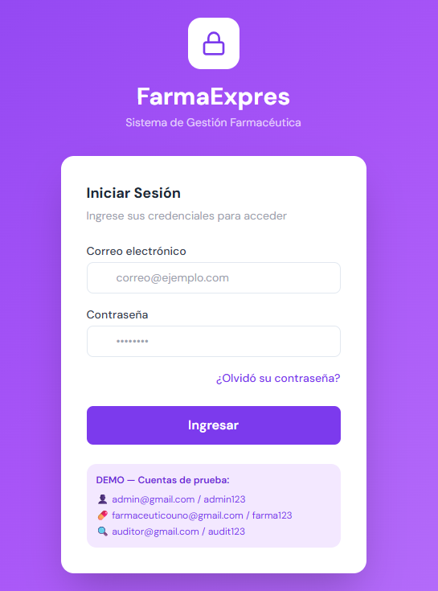

---

### Recuperar Contraseña

Descripción:  
Permite al usuario recuperar el acceso mediante correo electrónico.

Elementos:
- Input de correo
- Botón para envío de código
- Mensaje informativo

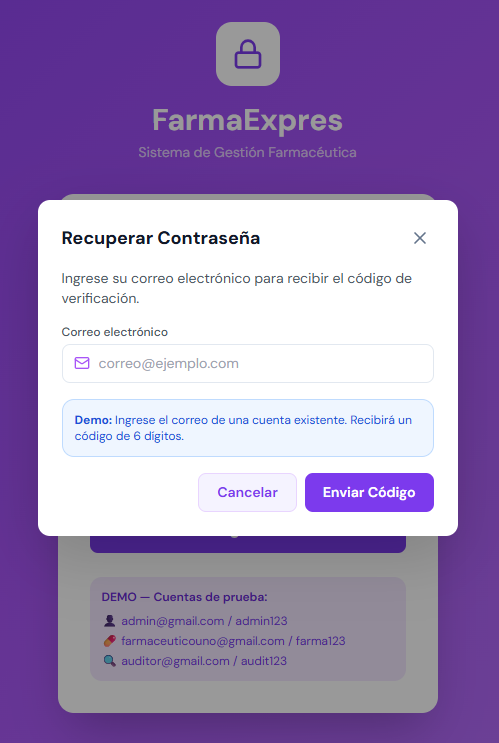

---

## Navegación del Sistema (Sidebar)

### Administrador

Descripción:  
Menú completo con acceso a todos los módulos del sistema.

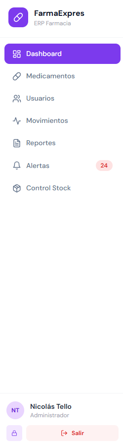

---

### Farmacéutico

Descripción:  
Menú enfocado en operaciones de inventario.

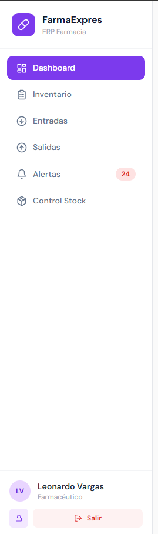

---

### Auditor

Descripción:  
Menú orientado a revisión y control del sistema.

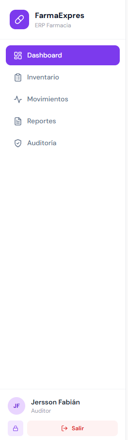

---

## Dashboard

Descripción:  
Vista principal con resumen general del sistema.

Elementos:
- Indicadores (medicamentos, stock, valor, alertas)
- Gráficos de movimientos
- Resumen de alertas
- Medicamentos con mayor movimiento

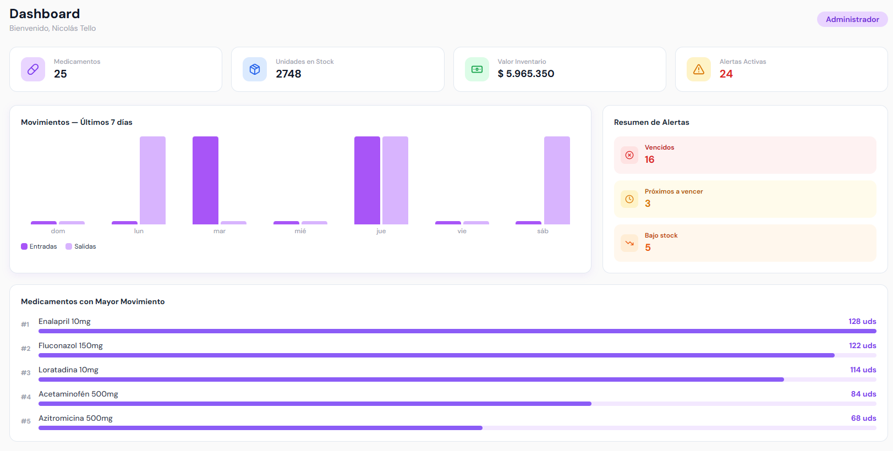

---

## Gestión de Usuarios (Users)

Descripción:  
Permite crear, visualizar y gestionar usuarios del sistema.

Elementos:
- Lista de usuarios
- Roles asignados
- Botón de creación
- Modal de registro

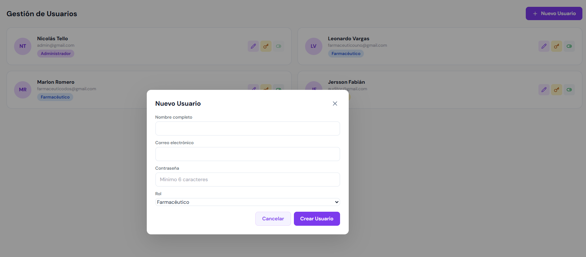

---

## Gestión de Medicamentos (Medicines)

Descripción:  
Permite administrar los medicamentos del inventario.

Elementos:
- Tabla de medicamentos
- Búsqueda
- Estado de vencimiento
- Modal de creación

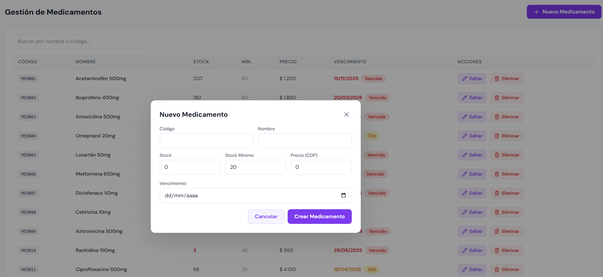

---

## Inventario (Inventory)

### Control de Stock

Descripción:  
Vista general del estado del inventario con análisis de stock.

Elementos:
- Productos críticos
- Indicadores de stock
- Niveles visuales
- Sugerencias de reposición

---

### Registro de Entradas

Descripción:  
Permite registrar el ingreso de medicamentos al inventario.

Elementos:
- Selección de medicamento
- Cantidad
- Motivo
- Historial de entradas

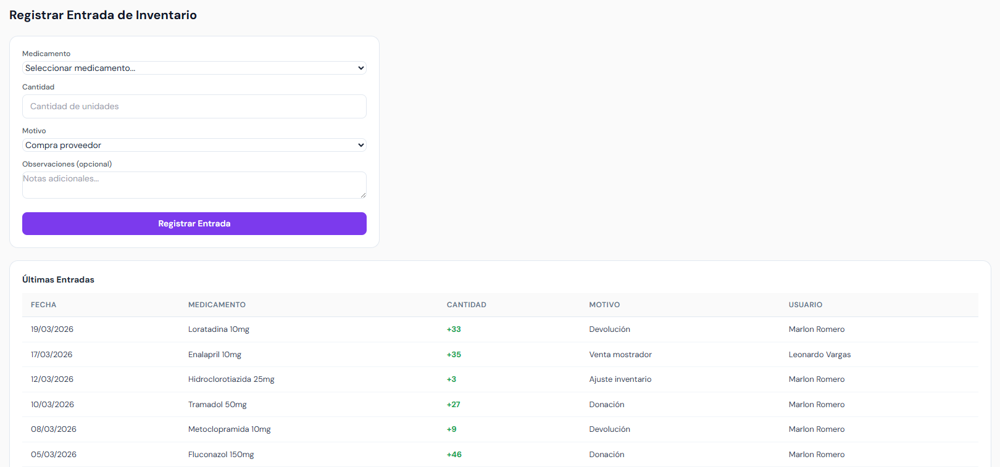

---

### Registro de Salidas

Descripción:  
Permite registrar la salida de medicamentos del inventario.

Elementos:
- Selección de medicamento
- Cantidad
- Motivo
- Historial de salidas

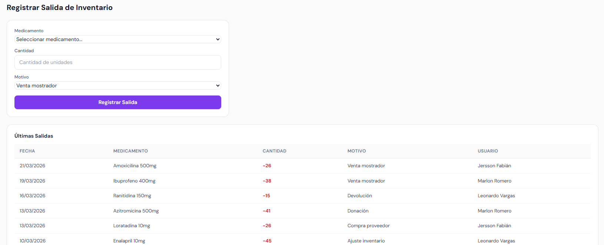

---

## Movimientos (Movements)

Descripción:  
Historial completo de entradas y salidas del sistema.

Elementos:
- Filtros por tipo, fecha y usuario
- Tabla de movimientos
- Estados de registros

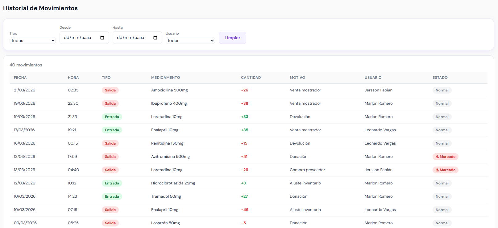

---

## Alertas (Alerts)

Descripción:  
Centro de notificaciones del sistema.

Elementos:
- Medicamentos vencidos
- Próximos a vencer
- Bajo stock

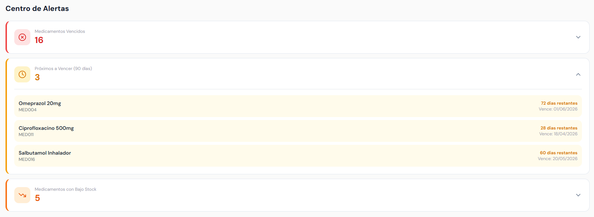

---

### Destrucción de Medicamentos

Descripción:  
Permite registrar la destrucción de productos vencidos.

Elementos:
- Información del producto
- Cantidad a destruir
- Método de destrucción
- Observaciones

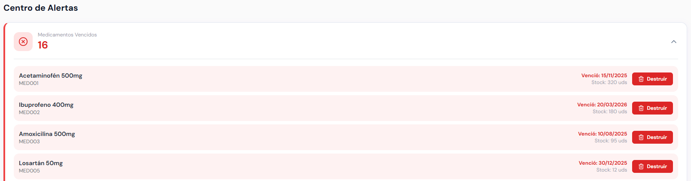
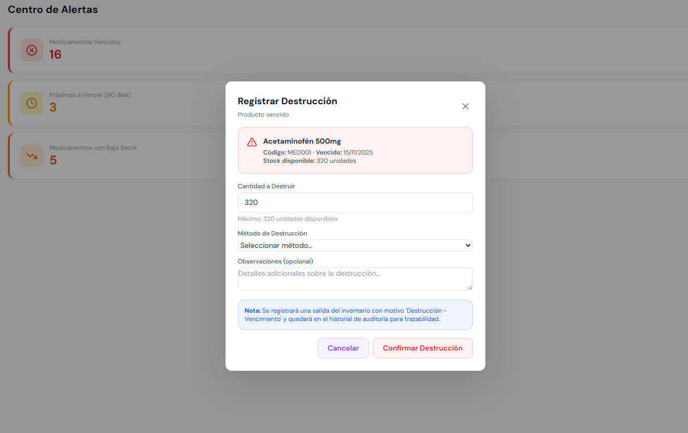

---

## Reportes (Reports)

### Inventario

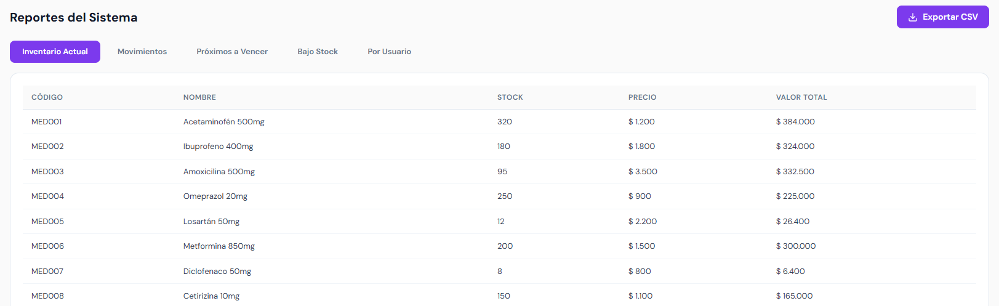

---

### Movimientos

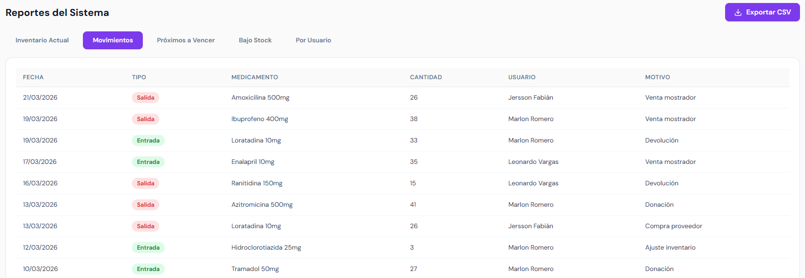

---

### Próximos a Vencer

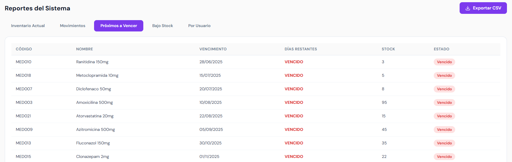

---

### Bajo Stock

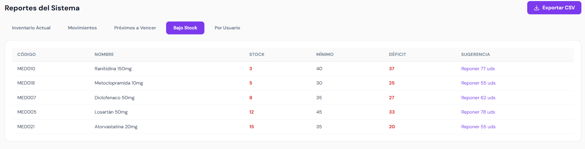

---

### Por Usuario

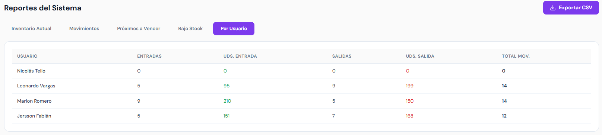

---

## Auditoría (Audit)

### Historial

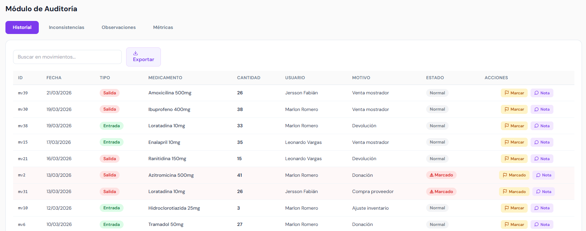

---

### Inconsistencias

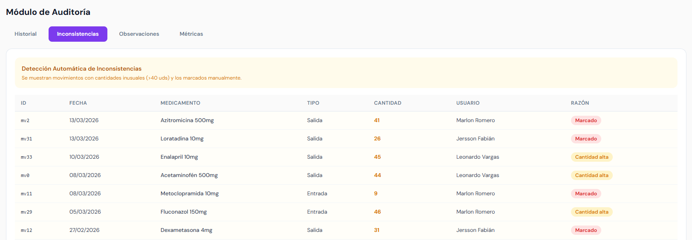

---

### Observaciones

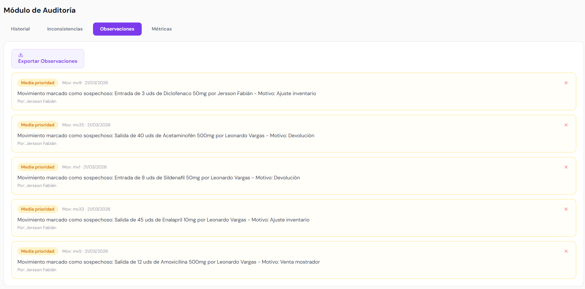

---

### Métricas

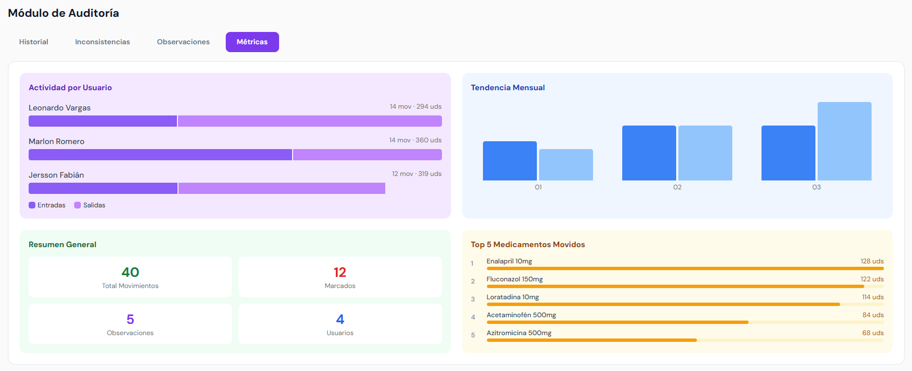

---

## Funcionalidades Globales

### Cambio de Contraseña

Descripción:  
Permite al usuario actualizar su contraseña.

Elementos:
- Contraseña actual
- Nueva contraseña
- Confirmación
- Validaciones de seguridad

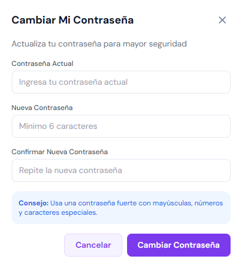

---

## Conclusión

El sistema FarmaExpres cuenta con una estructura modular clara, basada en roles y funcionalidades específicas. Cada vista está diseñada para facilitar la gestión del inventario farmacéutico, garantizando control, trazabilidad y seguridad en las operaciones.