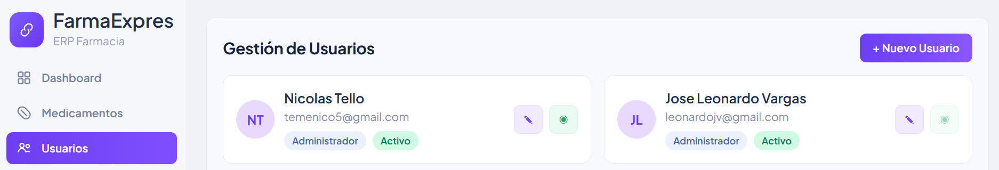
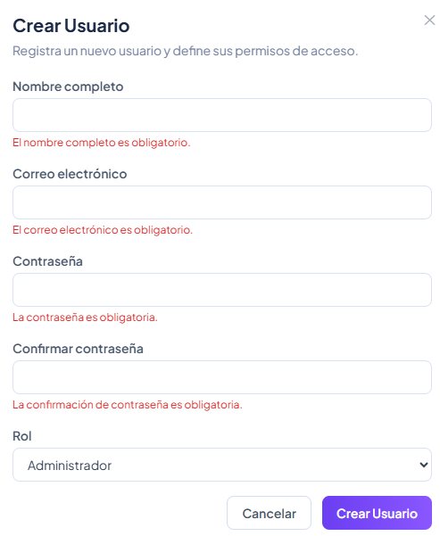
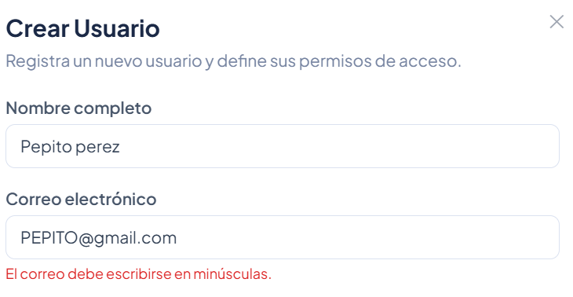
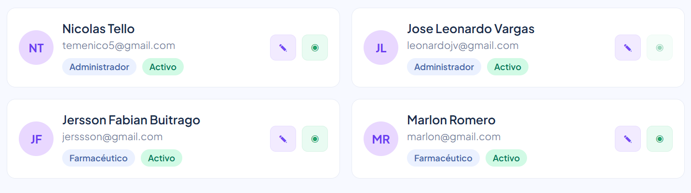
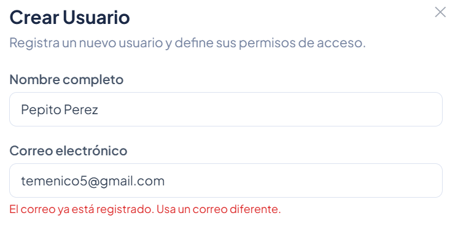
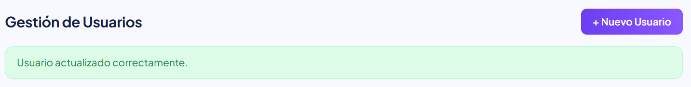
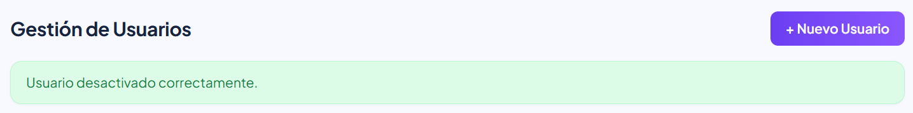
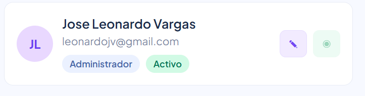

# HU-QA-FE-01 - Gestión de Usuarios

## 1. Historia de Usuario

### 1.1 Identificación

- **Título:** Gestión de Usuarios desde la interfaz
- **ID:** HU-FE-01
- **Relacionado:** HU-RF-01 (Backend)
- **Prioridad:** Must Have (Alta)

### 1.2 Descripción

Como **administrador del sistema**,
quiero **gestionar usuarios desde la interfaz web**,
para **controlar quién accede al sistema y mantener sus datos actualizados**.

### 1.3 Criterios de Aceptación

#### Interfaz

- [x] Existe botón visible `+ Nuevo Usuario` para rol administrador.
- [x] Al hacer clic se abre modal/formulario de creación.
- [x] Se visualiza listado de usuarios en el módulo `Usuarios`.
- [x] Se visualizan acciones de **Editar** y **Activar/Desactivar** por usuario.

#### Formulario de creación

- [x] Campo **Nombre completo** (obligatorio).
- [x] Campo **Correo electrónico** (obligatorio).
- [x] Campo **Contraseña** (obligatorio).
- [x] Campo **Confirmar contraseña** (obligatorio).
- [x] Selector de **Rol** (Administrador/Farmacéutico/Auditor).

#### validaciones

- [x] Todos los campos obligatorios.
- [x] Correo con formato válido.
- [x] Correo en minúsculas (si tiene mayúsculas, muestra error).
- [x] Contraseña con longitud mínima.
- [x] Coincidencia de contraseña y confirmación.

#### Integración con Backend

- [x] Creación: `POST /usuarios`.
- [x] Listado: `GET /usuarios`.
- [x] Edición: `PUT /usuarios/{id}`.
- [x] Cambio de estado: `PATCH /usuarios/{id}/estado` (con rutas alternas activar/desactivar).
- [x] Envío de token en header `Authorization: Bearer <token>`.

#### Respuesta del Sistema

**Éxito:**

- [x] Cierre del modal correspondiente.
- [x] Mensaje de confirmación.
- [x] Lista de usuarios actualizada sin recarga de página.

**Error:**

- [x] Mensaje por correo duplicado.
- [x] Mensaje por falta de permisos.
- [x] Mensaje cuando alguna operación no está habilitada en backend.

#### Control de Acceso

- [x] Solo `Administrador` puede crear, editar y activar/desactivar usuarios.
- [x] Usuario sin permisos no puede ejecutar acciones de gestión.

### 1.4 Checklist QA

- [x] No permite envío de formulario vacío.
- [x] No permite correos inválidos.
- [x] No permite correos con mayúsculas.
- [x] No permite contraseñas diferentes.
- [x] Maneja error de correo duplicado.
- [x] Permite editar usuario y refleja cambios en tabla/listado.
- [x] Permite desactivar usuario y reflejar estado.
- [x] Impide autodesactivación del administrador principal.
- [x] Actualiza datos sin recargar página.

### 1.5 Notas Técnicas

- El consumo de API se realiza con Axios.
- El cifrado/hash de contraseña se gestiona en backend.
- La validación de duplicidad depende del backend.
- El frontend restringe acciones por rol administrador.
- El estado de usuario se maneja como `ACTIVO/INACTIVO`.

### 1.6 Flujo de Usuario

1. El administrador entra al módulo `Usuarios`.
2. Crea un nuevo usuario con rol definido.
3. El nuevo usuario aparece en el listado.
4. El administrador edita datos de un usuario existente.
5. El administrador activa o desactiva usuarios según necesidad.
6. El sistema confirma cada acción o muestra error controlado.

---

## 2. Casos de Prueba Ejecutados (HU-FE-01)

> Ruta de evidencias: `doc/images/HU-FE-01/`

### CP-HU-FE-01-01 - Ingreso al módulo y botón Nuevo Usuario

- **Objetivo:** validar acceso visual a gestión de usuarios como admin.
- **Acción ejecutada:** Ingreso con usuario administrador al módulo `Usuarios`.
- **Resultado evidenciado:** Se visualiza botón `+ Nuevo Usuario`.
- **Evidencia:**

### CP-HU-FE-01-02 - validaciones de creación (campos obligatorios)

- **Objetivo:** Verificar que no se permita envío vacío.
- **Acción ejecutada:** Intento de guardar formulario sin completar datos.
- **Resultado evidenciado:** Mensajes de validación en campos obligatorios.
- **Evidencia:**

### CP-HU-FE-01-03 - validación de correo en minúsculas

- **Objetivo:** Confirmar regla de correo en minúsculas.
- **Acción ejecutada:** Ingreso de correo con mayúsculas.
- **Resultado evidenciado:** Mensaje de error indicando uso de minúsculas.
- **Evidencia:**

### CP-HU-FE-01-04 - Creación exitosa de usuario

- **Objetivo:** validar flujo Éxitoso de alta.
- **Acción ejecutada:** Registro de usuario con datos válidos.
- **Resultado evidenciado:** Mensaje de éxito y nuevo usuario en listado.
- **Evidencia:**

### CP-HU-FE-01-05 - Error por correo duplicado

- **Objetivo:** validar control de duplicidad.
- **Acción ejecutada:** Intento de crear usuario con correo ya existente.
- **Resultado evidenciado:** Mensaje claro de correo duplicado.
- **Evidencia:**

### CP-HU-FE-01-06 - Edición de usuario

- **Objetivo:** validar actualización de datos de usuario.
- **Acción ejecutada:** Editar nombre/correo/rol de un usuario existente.
- **Resultado evidenciado:** Cambios persistidos y visibles en listado.
- **Evidencia:**

### CP-HU-FE-01-07 - Desactivación de usuario

- **Objetivo:** validar eliminación lógica/desactivación.
- **Acción ejecutada:** Desactivar usuario desde acción de estado.
- **Resultado evidenciado:** Usuario pasa a estado inactivo y UI actualizada.
- **Evidencia:**

### CP-HU-FE-01-08 - Bloqueo de autodesactivación admin principal

- **Objetivo:** validar regla de negocio crítica.
- **Acción ejecutada:** Intento del admin autenticado de desactivarse a sí mismo.
- **Resultado evidenciado:** Sistema bloquea acción y muestra mensaje de error.
- **Evidencia:**

---

## 3. Conclusiones de Prueba

- La HU-FE-01 queda implementada para gestión de usuarios: crear, listar, editar y activar/desactivar.
- Se mantiene control de acceso por rol administrador para operaciones de gestión.
- Se cumplen validaciones funcionales de correo, contraseña, duplicidad y estado.

