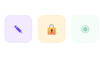
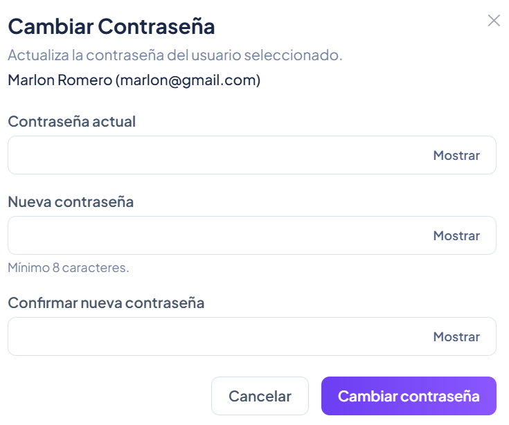
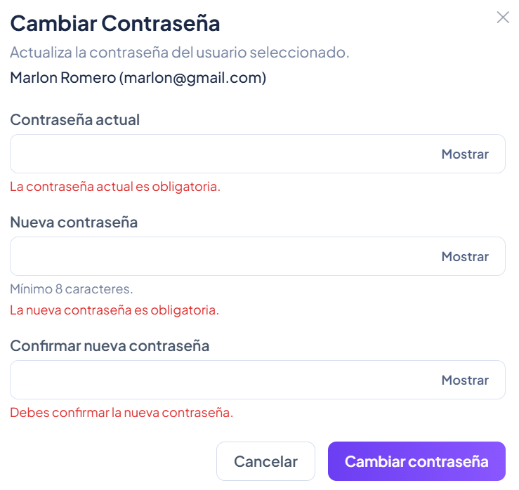
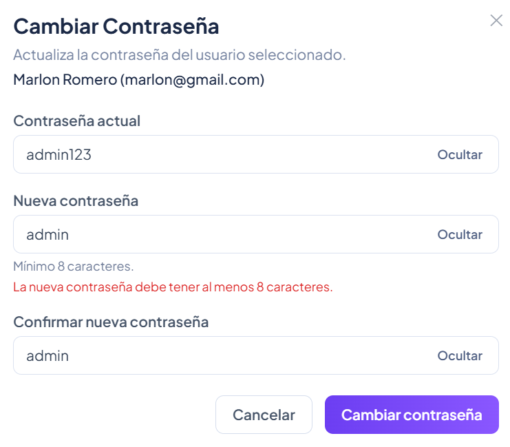
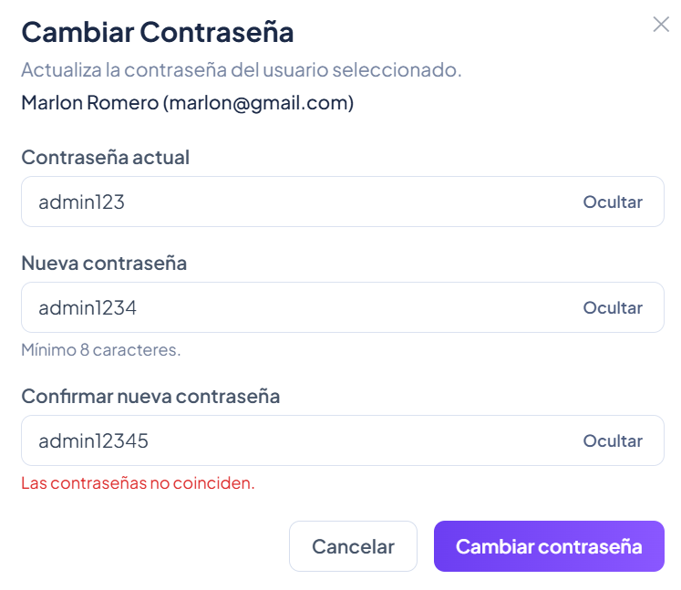
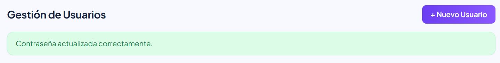
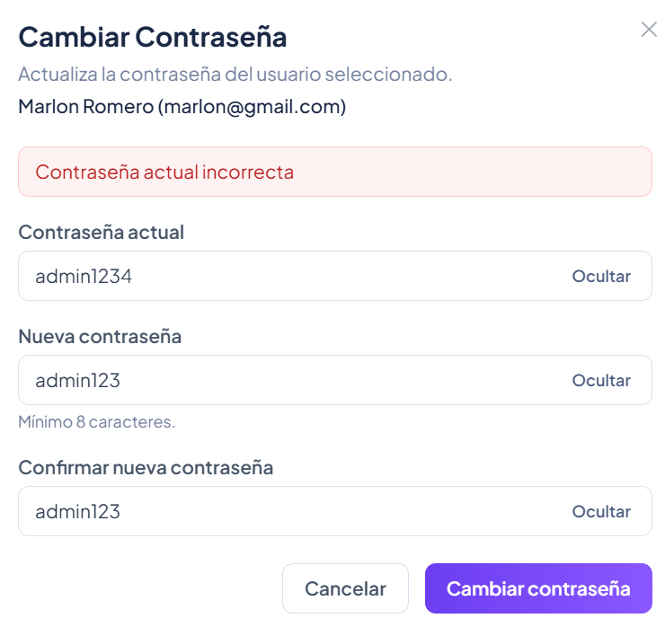
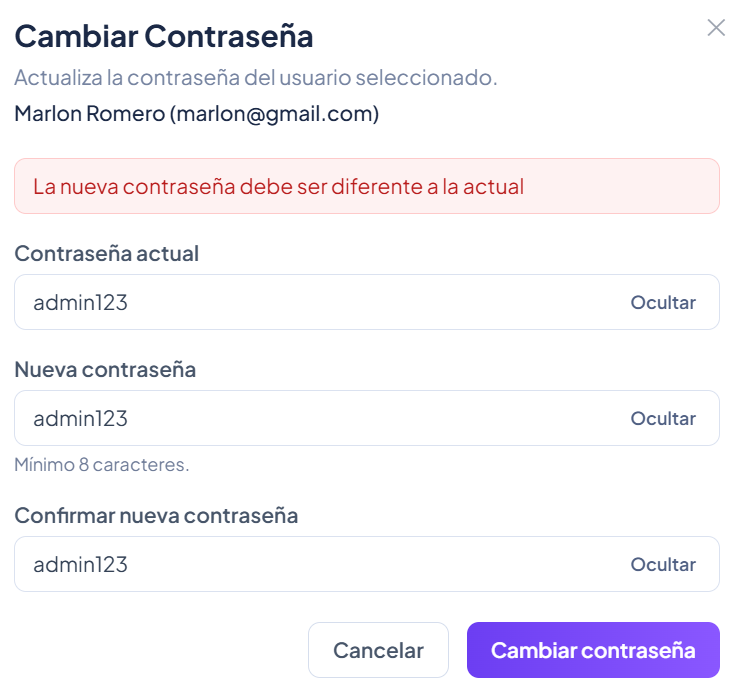

# HU-QA-FE-03 - Gestión de Usuarios - Cambio de Contraseña

## 1. Historia de Usuario

### 1.1 Identificación

- **Título:** Gestión de Usuarios - Cambio de Contraseña
- **ID:** HU-FE-03
- **Relacionado:** HU-RF-03 (Backend)
- **Prioridad:** Must Have (Alta)

### 1.2 Descripción

Como **administrador del sistema**,
quiero **cambiar la contraseña de un usuario desde la interfaz**,
para **mantener la seguridad de las cuentas dentro del sistema**.

### 1.3 Criterios de Aceptación

#### Interfaz

- [x] En la tabla de usuarios existe la acción **Cambiar contraseña**.
- [x] Al hacer clic se abre un modal de cambio de contraseña.

#### Formulario

- [x] Campo **Contraseña actual** (obligatorio).
- [x] Campo **Nueva contraseña** (obligatorio).
- [x] Campo **Confirmar contraseña** (obligatorio).
- [x] Visualización del usuario seleccionado (nombre y correo).

#### validaciones

- [x] válida campos obligatorios.
- [x] válida longitud mínima de contraseña.
- [x] válida coincidencia entre nueva contraseña y confirmación.
- [x] válida que la nueva contraseña sea diferente a la actual.

#### Integración con Backend

- [x] Se realiza petición principal hacia `PUT /usuarios/{id}/password`.
- [x] Se envía identificador del usuario, contraseña actual y nueva contraseña.
- [x] Se conserva envío de token en `Authorization: Bearer <token>`.
- [x] Se agregan rutas/payload alternos para compatibilidad temporal de backend.

#### Respuesta del Sistema

**Éxito:**

- [x] Se cierra el modal.
- [x] Se muestra mensaje: `Contraseña actualizada correctamente.`

**Error:**

- [x] Muestra error si falla la operación.
- [x] Muestra error cuando la contraseña actual no es válida.

#### Control de Acceso

- [x] Solo usuarios con rol **Administrador** pueden ver y ejecutar la acción.
- [x] Usuarios sin permisos no pueden acceder a esta funcionalidad.

### 1.4 Checklist QA

- [x] No permite campos vacíos.
- [x] No permite contraseñas diferentes.
- [x] No permite reutilizar la contraseña actual.
- [x] Solo admin puede ejecutar la acción.
- [x] Muestra confirmación al actualizar.
- [x] Maneja errores del backend correctamente.

### 1.5 Notas Técnicas

- El frontend reutiliza el módulo `users` existente (`UsersTable`, `UsersPage`, `UserPasswordModal`).
- El flujo principal envía `passwordActual` y `nuevaPassword` al endpoint de cambio de contraseña.
- El servicio `changeUserPassword` mantiene variantes de payload/ruta para compatibilidad entre entornos.

### 1.6 Flujo de Usuario

1. El administrador accede al módulo de usuarios.
2. Visualiza la lista y selecciona un usuario.
3. Hace clic en **Cambiar contraseña**.
4. Ingresa contraseña actual, nueva contraseña y confirmación.
5. Confirma la acción.
6. El sistema muestra resultado de éxito o error controlado.

---

## 2. Casos de Prueba Ejecutados (HU-FE-03)

> Ruta de evidencias: `doc/images/HU-FE-03/`

### CP-HU-FE-03-01 - Visualización de acción Cambiar contraseña

- **Objetivo:** validar que la acción exista por cada usuario en tabla.
- **Acción ejecutada:** Ingreso con admin y revisión de acciones por tarjeta.
- **Resultado evidenciado:** Se visualiza botón de cambio de contraseña.
- **Comentario del caso:** Cumple criterio de interfaz para iniciar flujo.
- **Evidencia:**

### CP-HU-FE-03-02 - Apertura de modal con usuario seleccionado

- **Objetivo:** Verificar apertura de modal con contexto del usuario.
- **Acción ejecutada:** Clic en acción **Cambiar contraseña**.
- **Resultado evidenciado:** Modal abierto mostrando nombre/correo del usuario.
- **Comentario del caso:** Facilita trazabilidad de a quién aplica el cambio.
- **Evidencia:**

### CP-HU-FE-03-03 - validación de campos obligatorios

- **Objetivo:** Verificar que el formulario no permita envío vacío.
- **Acción ejecutada:** Intento de guardar sin completar datos.
- **Resultado evidenciado:** Mensajes de error para campos requeridos.
- **Comentario del caso:** Evita llamadas inválidas al backend.
- **Evidencia:**

### CP-HU-FE-03-04 - validación de longitud mínima

- **Objetivo:** Confirmar restricción de seguridad por longitud.
- **Acción ejecutada:** Ingreso de contraseña menor al mínimo y envío.
- **Resultado evidenciado:** Mensaje de longitud mínima.
- **Comentario del caso:** Se cumple validación de seguridad en frontend.
- **Evidencia:**

### CP-HU-FE-03-05 - validación de confirmación de contraseña

- **Objetivo:** Confirmar que las contraseñas deben coincidir.
- **Acción ejecutada:** Ingreso de valores distintos en nueva/confirmación.
- **Resultado evidenciado:** Mensaje `Las contraseñas no coinciden`.
- **Comentario del caso:** Previene errores de digitación.
- **Evidencia:**

### CP-HU-FE-03-06 - Cambio Éxitoso de contraseña

- **Objetivo:** validar flujo Éxitoso de actualización.
- **Acción ejecutada:** Envío de formulario con datos válidos.
- **Resultado evidenciado:** Cierre de modal y mensaje de éxito.
- **Comentario del caso:** Cumple respuesta esperada del sistema.
- **Evidencia:**

### CP-HU-FE-03-07 - Error por contraseña actual incorrecta

- **Objetivo:** Verificar control funcional cuando la contraseña actual no coincide.
- **Acción ejecutada:** Ingreso de contraseña actual incorrecta con nueva contraseña válida.
- **Resultado evidenciado:** Mensaje claro indicando que la contraseña actual es incorrecta.
- **Comentario del caso:** Mantiene seguridad y evita cambios sin validación de credenciales.
- **Evidencia:**

### CP-HU-FE-03-08 - validación de nueva contraseña diferente a la actual

- **Objetivo:** Verificar que no se permita usar la misma contraseña actual como nueva contraseña.
- **Acción ejecutada:** Ingreso de la misma contraseña en `Contraseña actual` y `Nueva contraseña`, luego envío del formulario.
- **Resultado evidenciado:** El sistema muestra error indicando que la nueva contraseña debe ser diferente a la actual.
- **Comentario del caso:** Se cumple la regla de consistencia de seguridad en el cambio de contraseña.
- **Evidencia:**

---

## 3. Conclusiones de Prueba

- La HU-FE-03 queda implementada en frontend con acción, modal, validaciones y control por rol admin.
- Se incluye manejo de errores funcionales y técnicos para el cambio de contraseña.
- Se valida contraseña actual en frontend/backend para reforzar seguridad del cambio de contraseña.

