# HU-QA-FE-04 - Registro de Medicamentos

## 1. Historia de Usuario

### 1.1 Identificación

- **Título:** Gestión de Medicamentos - Registro
- **ID:** HU-FE-04
- **Relacionado:** HU-RF-04 (Backend)
- **Prioridad:** Must Have (Alta)

### 1.2 Descripción

Como **administrador del sistema**,
quiero **registrar nuevos medicamentos desde la interfaz**,
para **mantener actualizado el inventario de la farmacia**.

Esta funcionalidad permite ingresar la información completa del medicamento, incluyendo su configuración inicial de stock.

### 1.3 Criterios de Aceptación

#### Interfaz

- [x] Existe un botón **Agregar medicamento**.
- [x] Al hacer clic se abre un **modal o formulario**.

#### Formulario

- [x] Campo **Código del medicamento** (obligatorio).
- [x] Campo **Nombre comercial** (obligatorio).
- [x] Campo **Stock inicial** (obligatorio).
- [x] Campo **Stock mínimo** (obligatorio).
- [x] Campo **Precio unitario** (obligatorio).
- [x] Campo **Fecha de vencimiento** (obligatorio).

#### Validaciones

- [x] Todos los campos son obligatorios.
- [x] El código no puede estar vacío.
- [x] El stock debe ser un número válido (>= 0).
- [x] El stock mínimo debe ser un número válido.
- [x] El precio debe ser un número válido.
- [x] La fecha debe ser válida.
- [x] No permite enviar formulario incompleto.

#### Integración con Backend

- [x] Se realiza petición **POST /medicines**.
- [x] Se envían: código, nombre, stock, stock mínimo, precio, fecha de vencimiento.
- [x] Se realiza petición **POST /productos** (endpoint vigente en backend actual).

#### Respuesta del Sistema

**Éxito:**

- [x] Se cierra el formulario.
- [x] Se muestra mensaje: "Medicamento registrado correctamente".
- [x] Se actualiza la lista de medicamentos.

**Error:**

- [x] Si el código ya existe: mostrar mensaje claro.
- [x] Mostrar error si falla el servidor.

#### Control de Acceso

- [x] Solo usuarios con rol **Administrador** pueden ver y usar esta funcionalidad.
- [x] Usuarios con rol **Farmacéutico** o **Auditor** no pueden acceder.

### 1.4 Checklist QA

- [x] No permite campos vacíos.
- [x] No permite valores negativos en stock.
- [x] No permite precios inválidos.
- [x] Muestra error si el código está duplicado.
- [x] Actualiza la tabla sin recargar la página.
- [x] Respeta los roles de acceso.

### 1.5 Notas Técnicas

- La validación de código duplicado depende del backend.
- El frontend solo muestra el mensaje de error.
- Incluir token en headers (`Authorization: Bearer`).
- Consumir API mediante peticiones HTTP.

### 1.6 Flujo de Usuario

1. El administrador accede al módulo de medicamentos.
2. Hace clic en **Agregar medicamento**.
3. Completa el formulario.
4. Envía la información.
5. El sistema valida y registra.
6. Se muestra confirmación.
7. El medicamento aparece en la lista.

---

## 2. Casos de Prueba Ejecutados (HU-FE-04)

> Ruta de evidencias: `doc/images/HU-FE-04/`

### CP-HU-FE-04-01 - Visualización del botón Agregar medicamento

- **Objetivo:** Verificar que la interfaz muestre el botón para iniciar el registro.
- **Acción ejecutada:** Se ingresó al módulo de medicamentos.
- **Resultado evidenciado:** El botón **+ Agregar medicamento** se muestra en la parte superior.
- **Comentario del caso:** Cumple el criterio de interfaz para habilitar el flujo de registro.
- **Evidencia:**

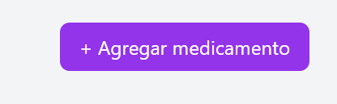

### CP-HU-FE-04-02 - Apertura de modal de registro

- **Objetivo:** Validar que el botón abra el formulario de registro.
- **Acción ejecutada:** Se hizo clic en **+ Agregar medicamento**.
- **Resultado evidenciado:** Se abre modal con los campos de captura.
- **Comentario del caso:** El flujo de apertura funciona correctamente.
- **Evidencia:**

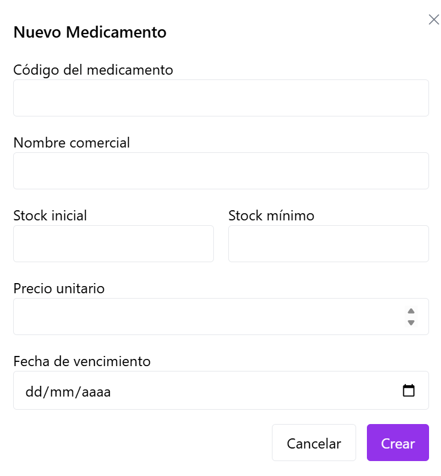

### CP-HU-FE-04-03 - Validación de formulario incompleto

- **Objetivo:** Verificar que el sistema no permita enviar el formulario vacío.
- **Acción ejecutada:** Se intentó crear el medicamento sin diligenciar campos.
- **Resultado evidenciado:** Se muestran mensajes de validación y no se procesa el envío.
- **Comentario del caso:** Cumple validación de obligatoriedad general.
- **Evidencia:**

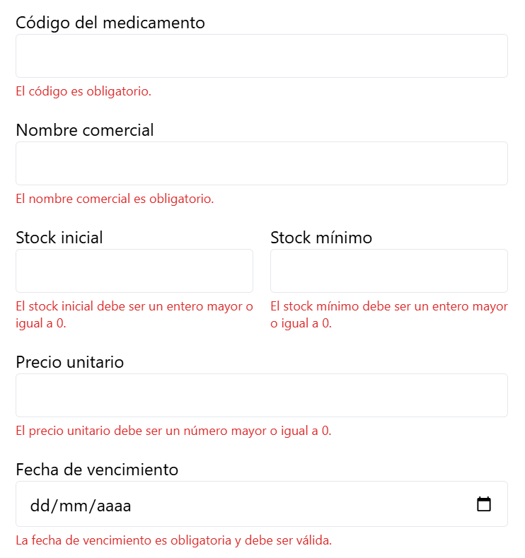

### CP-HU-FE-04-04 - Validación de código vacío

- **Objetivo:** Confirmar que el código no puede estar vacío.
- **Acción ejecutada:** Se dejó vacío el campo código y se intentó enviar.
- **Resultado evidenciado:** El sistema marca error en campo código.
- **Comentario del caso:** Se bloquea correctamente una entrada inválida clave.
- **Evidencia:**

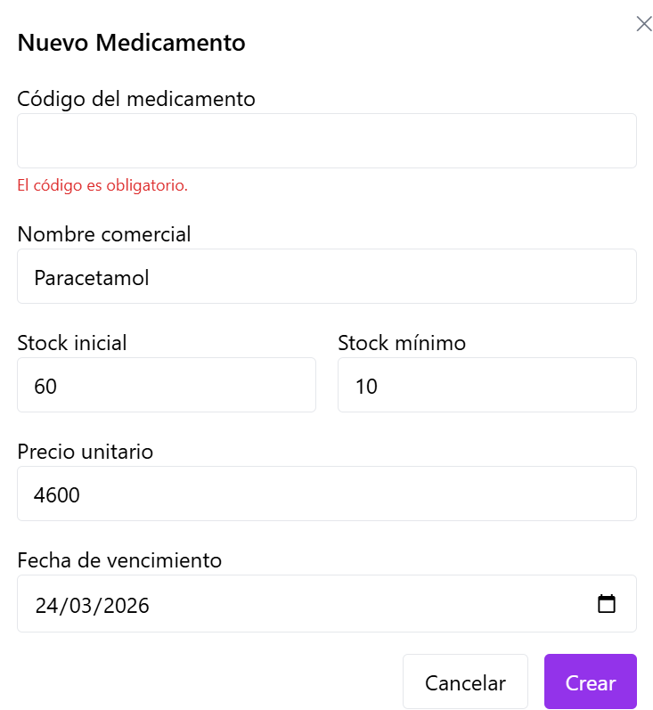

### CP-HU-FE-04-05 - Validación de stock inicial negativo

- **Objetivo:** Validar regla de negocio de stock inicial >= 0.
- **Acción ejecutada:** Se ingresó un valor negativo en stock inicial.
- **Resultado evidenciado:** Se muestra mensaje de error y no se envía formulario.
- **Comentario del caso:** La validación numérica evita datos inconsistentes.
- **Evidencia:**

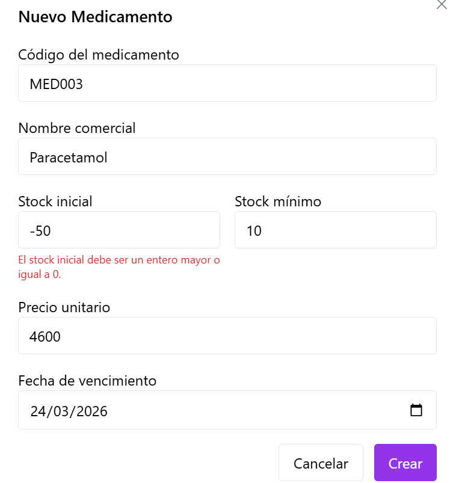

### CP-HU-FE-04-06 - Validación de stock mínimo negativo

- **Objetivo:** Verificar restricción de stock mínimo válido.
- **Acción ejecutada:** Se ingresó valor negativo en stock mínimo.
- **Resultado evidenciado:** Se refleja error y se bloquea el envío.
- **Comentario del caso:** La validación protege el control futuro de alertas.
- **Evidencia:**

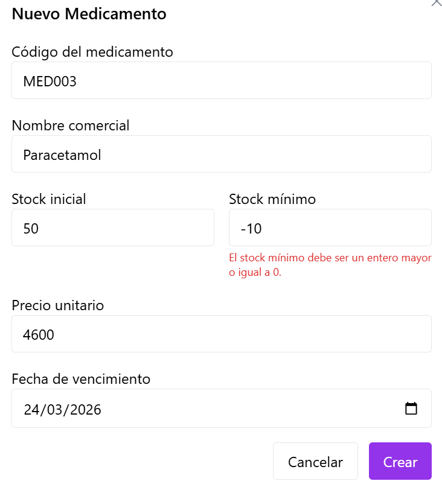

### CP-HU-FE-04-07 - Validación de precio inválido

- **Objetivo:** Comprobar que el precio debe ser numérico y válido.
- **Acción ejecutada:** Se ingresó precio inválido y se intentó registrar.
- **Resultado evidenciado:** El sistema marca error en precio.
- **Comentario del caso:** Cumple con validación de formato de datos económicos.
- **Evidencia:**

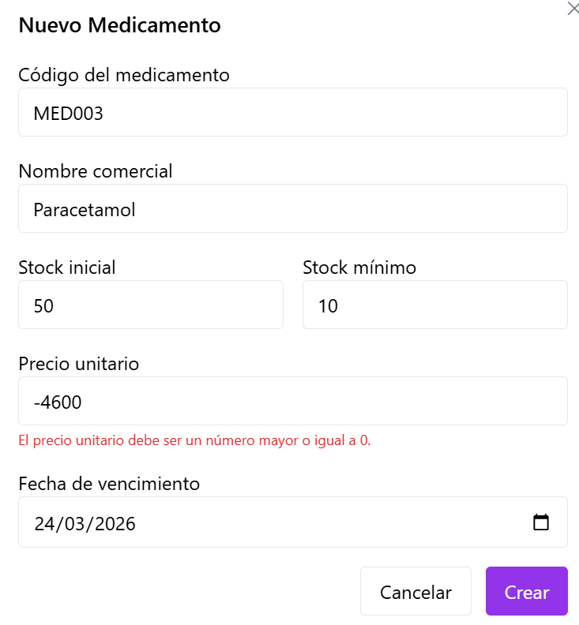

### CP-HU-FE-04-08 - Validación de fecha inválida

- **Objetivo:** Validar que la fecha de vencimiento sea obligatoria y válida.
- **Acción ejecutada:** Se dejó fecha inválida/vacía en el formulario.
- **Resultado evidenciado:** El sistema muestra error de fecha.
- **Comentario del caso:** Se evita guardar registros incompletos para trazabilidad.
- **Evidencia:**

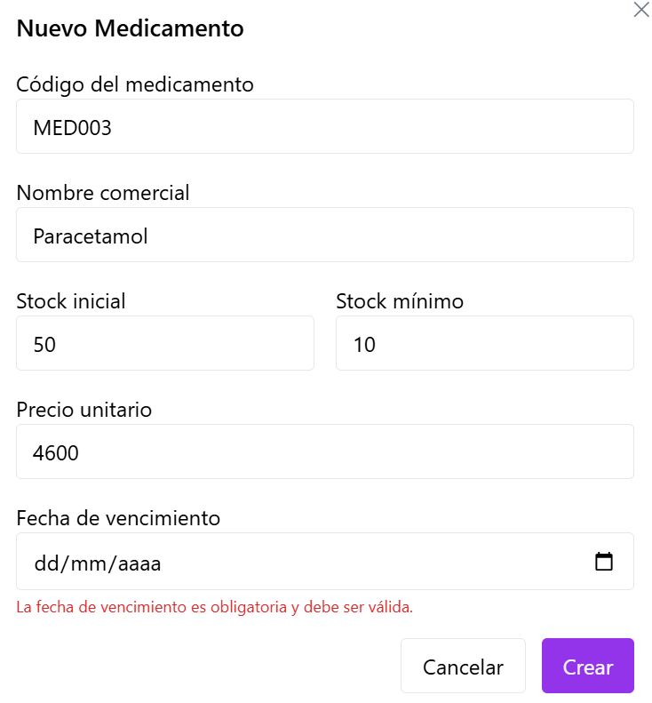

### CP-HU-FE-04-09 - Registro exitoso de medicamento

- **Objetivo:** Verificar el flujo exitoso de creación.
- **Acción ejecutada:** Se diligenciaron datos válidos y se envió formulario.
- **Resultado evidenciado:** Mensaje **Medicamento registrado correctamente** y cierre de modal.
- **Comentario del caso:** Confirma funcionamiento principal de la HU en escenario positivo.
- **Evidencia:**

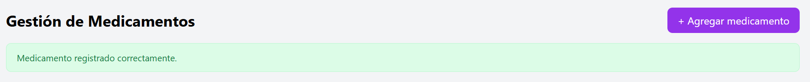

### CP-HU-FE-04-10 - Actualización de tabla sin recarga manual

- **Objetivo:** Comprobar refresco de listado en la misma vista.
- **Acción ejecutada:** Se registró un medicamento y se observó la tabla.
- **Resultado evidenciado:** El listado se actualiza sin recargar manualmente el navegador.
- **Comentario del caso:** Se cumple experiencia de usuario esperada para operación continua.
- **Evidencia:**

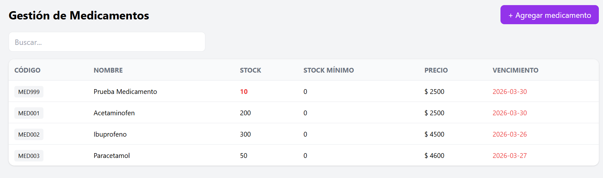

### CP-HU-FE-04-11 - Manejo de código duplicado

- **Objetivo:** Verificar mensaje claro cuando backend rechaza código repetido.
- **Acción ejecutada:** Se intentó registrar medicamento con código existente.
- **Resultado evidenciado:** Se muestra mensaje de error por duplicidad de código.
- **Comentario del caso:** Cumple manejo de error funcional dependiente del backend.
- **Evidencia:**

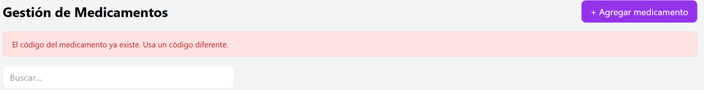

### CP-HU-FE-04-12 - Manejo de error de servidor

- **Objetivo:** Validar respuesta visual ante fallo técnico del backend.
- **Acción ejecutada:** Se forzó escenario de error del servicio.
- **Resultado evidenciado:** La interfaz presenta mensaje de error al usuario.
- **Comentario del caso:** El sistema informa el fallo sin bloquear toda la vista.
- **Evidencia:**

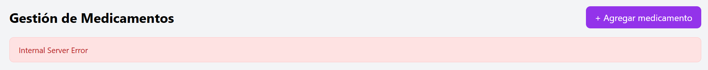

---

## 3. Conclusiones de Prueba

- La HU-FE-04 cuenta con evidencia visual para flujo de interfaz, validaciones, éxito y errores.
- Se documenta cobertura funcional del registro de medicamentos en frontend.
- El control de acceso por rol queda pendiente hasta implementar login y autorización completa.
