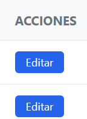
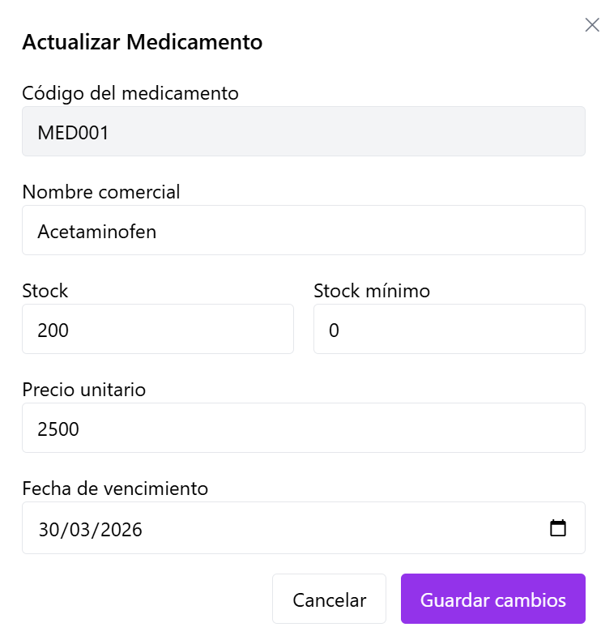
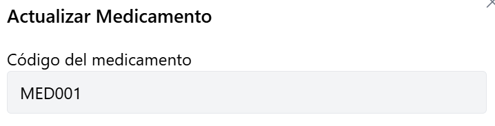
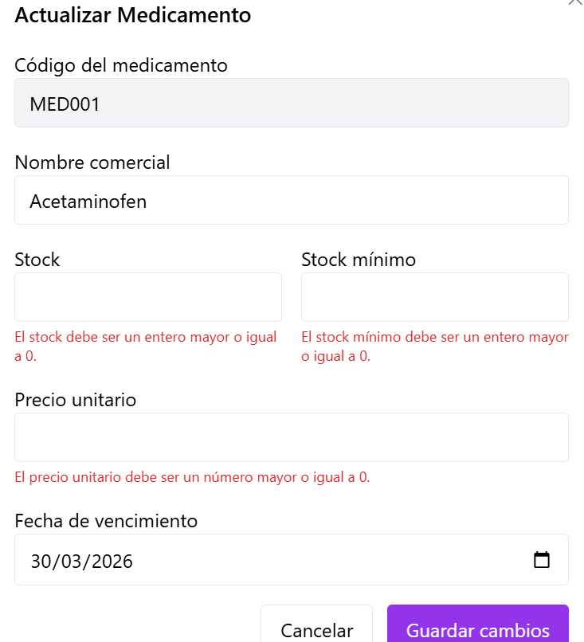
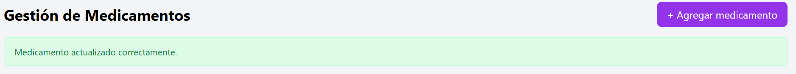
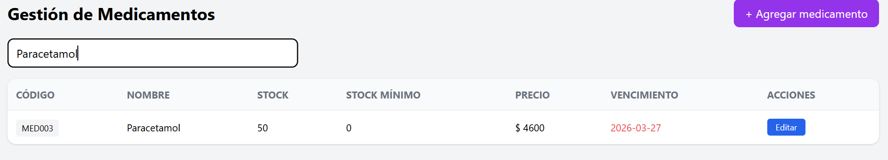

# HU-QA-FE-05 - Actualización de Medicamentos

## 1. Historia de Usuario

### 1.1 Identificación

- **Título:** Gestión de Medicamentos - Actualización
- **ID:** HU-FE-05
- **Relacionado:** HU-RF-05 (Backend)
- **Prioridad:** Must Have (Alta)

### 1.2 Descripción

Como **administrador del sistema**,
quiero **actualizar la información de un medicamento desde la interfaz**,
para **mantener los datos del inventario actualizados y correctos**.

### 1.3 Criterios de Aceptación

#### Interfaz

- [x] En la tabla de medicamentos existe acción **Editar**.
- [x] Al hacer clic se abre modal con datos precargados.
- [x] Campo de búsqueda funcional por **código** o **nombre** (mejora de usabilidad).

#### Formulario

- [x] Campo **Código del medicamento** visible y no editable.
- [x] Campo **Nombre comercial** editable.
- [x] Campo **Stock** editable.
- [x] Campo **Stock mínimo** editable.
- [x] Campo **Precio unitario** editable.
- [x] Campo **Fecha de vencimiento** editable.

#### Validaciones

- [x] Campos obligatorios con validación en frontend.
- [x] El código no se puede modificar.
- [x] Stock válido (entero >= 0).
- [x] Precio válido (número >= 0).
- [x] Fecha válida de vencimiento.

#### Integración con Backend

- [x] Se realiza petición **PUT /productos/{id}** (endpoint vigente en backend actual).
- [x] Se envían campos editables: nombre, stock, stock mínimo, precio y fecha de vencimiento.

#### Respuesta del Sistema

**Éxito:**

- [x] Se cierra el formulario.
- [x] Se muestra mensaje: "Medicamento actualizado correctamente.".
- [x] Se actualiza la tabla sin recarga manual.

**Error:**

- [x] Se muestra error claro si falla la actualización.
- [x] Se muestra error claro si el medicamento no existe.

#### Control de Acceso

- [ ] Solo usuarios con rol **Administrador** pueden editar medicamentos.
- [ ] Usuarios con rol **Farmacéutico** o **Auditor** no pueden acceder.

### 1.4 Checklist QA

- [x] El código no es editable.
- [x] Los datos se cargan en el formulario de edición.
- [x] No permite valores inválidos.
- [x] Guarda cambios y muestra confirmación.
- [x] Actualiza tabla sin recargar la página.
- [ ] Respeta roles de acceso (pendiente de módulo auth/roles en frontend).

### 1.5 Notas Técnicas

- El identificador del medicamento se toma desde `id` del registro.
- El código no se envía en el `PUT` para evitar cambios de identificador funcional.
- Se conserva manejo de token vía `Authorization: Bearer`.
- Se mantiene consumo sobre endpoint de backend actual: `/productos/{id}`.
- Se implementa filtro local en frontend por `código` y `nombre`, sin cambios de contrato backend.
- **Pendiente backend:** en la revisión de `inventory-service`, el método de actualización actualmente persiste `nombre`, `stock` y `precio`; `fechavencimiento` y `stockMinimo` dependen de ajustes del servicio backend para persistirlos completamente.

### 1.6 Flujo de Usuario

1. El administrador entra al módulo de medicamentos.
2. Visualiza lista y hace clic en **Editar**.
3. El sistema abre modal con datos precargados.
4. Modifica datos permitidos y guarda cambios.
5. El sistema valida, actualiza y confirma resultado.
6. La tabla refleja los cambios sin recargar la página.

---

## 2. Casos de Prueba Ejecutados (HU-FE-05)

> Ruta de evidencias: `doc/images/HU-FE-05/`

### CP-HU-FE-05-01 - Visualización de acción Editar

- **Objetivo:** Verificar que cada fila tenga acción de edición.
- **Acción ejecutada:** Se ingresó al módulo de medicamentos y se revisó tabla.
- **Resultado evidenciado:** Se muestra botón **Editar** por registro.
- **Comentario del caso:** Permite iniciar flujo de actualización.
- **Evidencia:**

### CP-HU-FE-05-02 - Apertura de modal con datos precargados

- **Objetivo:** Confirmar precarga de información al editar.
- **Acción ejecutada:** Se hizo clic en **Editar** sobre un medicamento existente.
- **Resultado evidenciado:** Se abre modal con valores actuales.
- **Comentario del caso:** Se reduce riesgo de errores por digitación.
- **Evidencia:**

### CP-HU-FE-05-03 - Código no editable

- **Objetivo:** Verificar que el código no pueda ser modificado.
- **Acción ejecutada:** Se intentó editar campo código.
- **Resultado evidenciado:** Campo bloqueado (solo lectura).
- **Comentario del caso:** Cumple regla de negocio sobre identificador funcional.
- **Evidencia:**

### CP-HU-FE-05-04 - Validaciones de campos inválidos

- **Objetivo:** Validar bloqueo de envío con datos inválidos.
- **Acción ejecutada:** Se ingresaron stock/precio inválidos y fecha inválida.
- **Resultado evidenciado:** Se muestran mensajes de error y no se envía formulario.
- **Comentario del caso:** Se protege integridad de datos desde frontend.
- **Evidencia:**

### CP-HU-FE-05-05 - Actualización exitosa

- **Objetivo:** Verificar flujo positivo de actualización.
- **Acción ejecutada:** Se modificaron datos válidos y se guardaron cambios.
- **Resultado evidenciado:** Mensaje de éxito, cierre de modal y refresco de tabla.
- **Comentario del caso:** Flujo principal de la HU funcional.
- **Evidencia:**

### CP-HU-FE-05-06 - Búsqueda por código o nombre

- **Objetivo:** Validar búsqueda local en la tabla de medicamentos.
- **Acción ejecutada:** Se ingresó texto por código y nombre en el campo de búsqueda.
- **Resultado evidenciado:** La tabla filtra registros coincidentes en tiempo real.
- **Comentario del caso:** Mejora la ubicación rápida de medicamentos sin recargar la vista.
- **Evidencia:**

---

## 3. Conclusiones de Prueba

- La HU-FE-05 queda implementada en frontend con flujo de actualización completo.
- Se mantiene coherencia con reglas de validación y feedback de HU-FE-04.
- Se incluye mejora de usabilidad con búsqueda local por código y nombre.
- La restricción formal por roles queda pendiente hasta consolidar autenticación/autorización en frontend.
- Los escenarios de error técnico y recurso no existente quedan como validación pendiente para ejecución posterior de QA.
