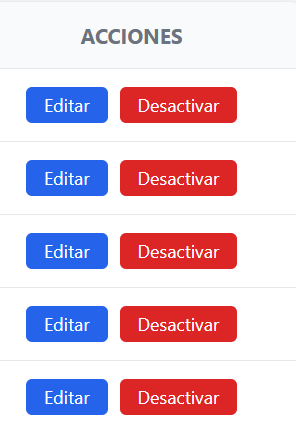
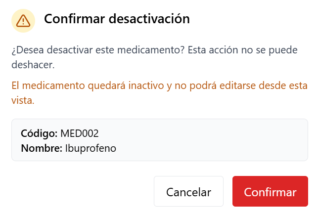
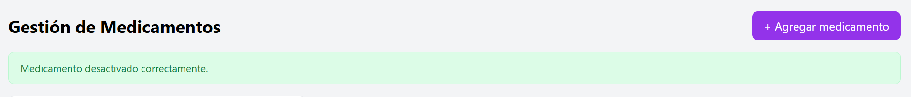
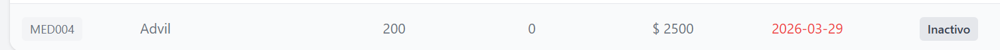
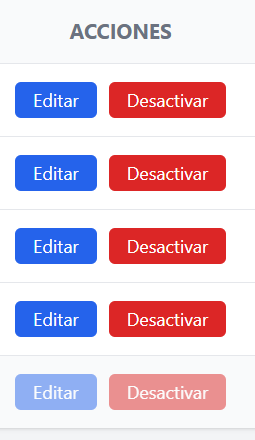

# HU-QA-FE-06 - Eliminación Lógica de Medicamentos

## 1. Historia de Usuario

### 1.1 Identificación

- **Título:** Gestión de Medicamentos - Eliminación Lógica
- **ID:** HU-FE-06
- **Relacionado:** HU-RF-06 (Backend)
- **Prioridad:** Must Have (Alta)

### 1.2 Descripción

Como **administrador del sistema**,
quiero **desactivar un medicamento desde la interfaz**,
para **evitar su uso en el sistema sin eliminar su historial**.

### 1.3 Criterios de Aceptación

#### Interfaz

- [x] En la tabla de medicamentos existe acción **Desactivar**.
- [x] Al hacer clic se muestra mensaje de confirmación.

#### Confirmación

- [x] Se muestra mensaje: "¿Desea desactivar este medicamento?".
- [x] Se permite confirmar o cancelar la acción.
- [x] La confirmación se presenta en modal visual de interfaz.

#### Integración con Backend

- [x] Se realiza petición **DELETE /productos/{id}** (endpoint vigente en backend actual).
- [x] Se envía el identificador del medicamento.

#### Respuesta del Sistema

**Éxito:**

- [x] Se muestra mensaje: "Medicamento desactivado correctamente.".
- [x] El medicamento cambia visualmente a estado **inactivo**.
- [x] Se actualiza la tabla sin recarga manual.

**Error:**

- [x] Se muestra error si falla la operación.
- [x] Se muestra error si el medicamento no existe.

#### Control de Acceso

- [ ] Solo usuarios con rol **Administrador** pueden desactivar medicamentos.
- [ ] Usuarios con rol **Farmacéutico** o **Auditor** no pueden acceder.

#### Restricciones del Sistema

- [x] Un medicamento inactivo no puede ser editado desde frontend.
- [ ] Un medicamento inactivo no puede usarse en movimientos (pendiente módulo movimientos).
- [x] Un medicamento inactivo se muestra visualmente como **Inactivo**.

### 1.4 Checklist QA

- [x] Muestra confirmación antes de desactivar.
- [ ] Solo admin puede ejecutar la acción (pendiente auth/roles en frontend).
- [x] El estado cambia correctamente a inactivo.
- [x] El medicamento no desaparece (sigue visible).
- [x] Se bloquean acciones de edición y desactivación sobre medicamentos inactivos.
- [x] Maneja errores del backend correctamente.

### 1.5 Notas Técnicas

- No se elimina el registro en base de datos; se usa desactivación lógica por estado.
- Se consume endpoint `DELETE /productos/{id}`.
- Se mantiene uso de token en headers `Authorization: Bearer`.
- Se agregó columna de estado para distinguir medicamentos activos/inactivos.
- **Pendiente backend:** restricción completa de uso en movimientos para productos inactivos.

### 1.6 Flujo de Usuario

1. El administrador accede al módulo de medicamentos.
2. Visualiza la lista y selecciona un registro activo.
3. Hace clic en **Desactivar**.
4. El sistema solicita confirmación.
5. Al confirmar, se ejecuta desactivación lógica.
6. El sistema muestra mensaje y actualiza la tabla.
7. El medicamento queda visible con estado **Inactivo**.

---

## 2. Casos de Prueba Ejecutados (HU-FE-06)

> Ruta de evidencias: `doc/images/HU-FE-06/`

### CP-HU-FE-06-01 - Visualización de acción Desactivar

- **Objetivo:** Verificar que exista acción de desactivación por registro.
- **Acción ejecutada:** Se ingresó al módulo de medicamentos y se revisó tabla.
- **Resultado evidenciado:** Se muestra botón **Desactivar** en filas activas.
- **Comentario del caso:** Cumple criterio de interfaz para iniciar flujo de eliminación lógica.
- **Evidencia:**

### CP-HU-FE-06-02 - Confirmación previa de desactivación

- **Objetivo:** Validar confirmación antes de ejecutar acción irreversible en UI.
- **Acción ejecutada:** Se hizo clic en **Desactivar** sobre un medicamento activo.
- **Resultado evidenciado:** Se muestra mensaje de confirmación con opciones confirmar/cancelar.
- **Comentario del caso:** Protege al usuario de ejecuciones accidentales.
- **Evidencia:**

### CP-HU-FE-06-03 - Desactivación exitosa

- **Objetivo:** Verificar flujo exitoso de eliminación lógica.
- **Acción ejecutada:** Se confirmó desactivación de un medicamento activo.
- **Resultado evidenciado:** Se muestra mensaje de éxito y la tabla se actualiza.
- **Comentario del caso:** La acción se ejecuta sin recarga manual.
- **Evidencia:**

### CP-HU-FE-06-04 - Estado visual inactivo

- **Objetivo:** Confirmar representación visual del estado inactivo.
- **Acción ejecutada:** Se revisó la fila del medicamento desactivado.
- **Resultado evidenciado:** El registro sigue visible y muestra estado **Inactivo**.
- **Comentario del caso:** Se conserva trazabilidad sin eliminar historial en interfaz.
- **Evidencia:**

### CP-HU-FE-06-05 - Bloqueo de acciones en medicamento inactivo

- **Objetivo:** Validar que no se permita editar/desactivar un registro inactivo.
- **Acción ejecutada:** Se intentó usar botones de acciones sobre medicamento inactivo.
- **Resultado evidenciado:** Botones deshabilitados para edición y desactivación.
- **Comentario del caso:** Cumple restricción funcional definida para frontend.
- **Evidencia:**

---

## 3. Conclusiones de Prueba

- La HU-FE-06 queda implementada en frontend con desactivación lógica y confirmación previa.
- Se mantiene trazabilidad visual del medicamento al no removerlo de la tabla.
- El control formal por roles y la restricción de uso en movimientos dependen de HU futuras de autenticación y movimientos.
- La validación de escenarios de error técnico queda como pendiente para ejecución posterior de QA.
